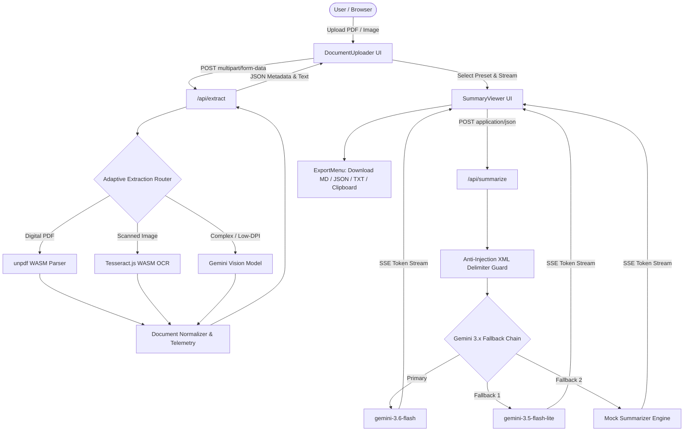

# DocuSense AI — Intelligent Document Summary & Critique Assistant

[](https://nextjs.org/)
[](https://react.dev/)
[](https://www.typescriptlang.org/)
[](https://tailwindcss.com/)
[](https://github.com/AdvaitVarhade/docusense-ai)
[](https://opensource.org/licenses/MIT)

**DocuSense AI** is a production-grade full-stack web application designed for intelligent document ingestion, multi-tier layout-aware OCR extraction, and real-time Server-Sent Events (SSE) AI summarization with actionable improvement critiques.

Built for the **Software Engineering Assessment Project**, DocuSense AI couples a **Hexagonal (Ports & Adapters) Architecture** with an adaptive extraction pipeline and multi-model Gemini 3.x fallback routing under a strict zero-cost free-tier operational model.

---

## 📑 Repository & Documentation Index

- **GitHub Repository**: [https://github.com/AdvaitVarhade/docusense-ai](https://github.com/AdvaitVarhade/docusense-ai)
- **Technical Architecture Specification (46-Section Blueprint)**: [`docs/ARCHITECTURE.md`](https://github.com/AdvaitVarhade/docusense-ai/blob/main/docs/ARCHITECTURE.md)
- **IEEE Software Requirements Specification (SRS)**: [`docs/IEEE_SRS_Document.md`](https://github.com/AdvaitVarhade/docusense-ai/blob/main/docs/IEEE_SRS_Document.md)
- **Product Requirements Document (PRD)**: [`docs/prd/PRD-Document-Summary-Assistant.md`](https://github.com/AdvaitVarhade/docusense-ai/blob/main/docs/prd/PRD-Document-Summary-Assistant.md)
- **200-Word Approach Write-Up**: [`docs/APPROACH_SUMMARY.md`](https://github.com/AdvaitVarhade/docusense-ai/blob/main/docs/APPROACH_SUMMARY.md)
- **Compiled PDF Documents**:
  - [IEEE SRS Specification PDF](https://github.com/AdvaitVarhade/docusense-ai/blob/main/docs/IEEE_SRS_Document.pdf)
  - [Technical Architecture PDF](https://github.com/AdvaitVarhade/docusense-ai/blob/main/docs/DocuSense_Technical_Architecture.pdf)
  - [Approach Summary PDF](https://github.com/AdvaitVarhade/docusense-ai/blob/main/docs/DocuSense_Approach_Writeup.pdf)
- **Architecture Decision Records (ADRs)**:
  - [ADR-001: Technology Stack Selection (Next.js 15 + TypeScript)](https://github.com/AdvaitVarhade/docusense-ai/blob/main/docs/adr/ADR-001-Tech-Stack-Selection.md)
  - [ADR-002: Multi-Tier Document Extraction Pipeline](https://github.com/AdvaitVarhade/docusense-ai/blob/main/docs/adr/ADR-002-Document-Extraction-Strategy.md)
  - [ADR-003: AI Model Routing, Streaming & Anti-Injection Guard](https://github.com/AdvaitVarhade/docusense-ai/blob/main/docs/adr/ADR-003-AI-Model-Routing-and-Streaming.md)
- **Defect & Anomaly Log**: [`docs/BUG_LOG.md`](https://github.com/AdvaitVarhade/docusense-ai/blob/main/docs/BUG_LOG.md)

---

## 🌟 Core Capabilities

### 1. Tri-Engine Adaptive Document Extraction
- **Tier 1 (Digital PDF Parser)**: High-speed in-memory text and layout extraction via WebAssembly (`unpdf`) in $< 50\text{ms}$ with zero AI token cost.
- **Tier 2 (Multimodal Vision Engine)**: Google Gemini Flash Vision extraction for complex multi-column documents, tables, and handwritten notes.
- **Tier 3 (Local WASM OCR)**: Zero-cost, 100% offline Optical Character Recognition powered by `tesseract.js` WebAssembly.

### 2. Multi-Fidelity AI Summarization
- **Short Mode (~150 words)**: High-impact executive TL;DR + 3 key takeaways.
- **Medium Mode (~400 words)**: Balanced thematic synthesis with structured sections.
- **Long Mode (~900 words)**: Comprehensive deep dive with methodology evaluation, key arguments, and risk factors.

### 3. Actionable Improvement Critiques
- Structured critique engine analyzing documents across **Clarity**, **Logical Structure**, **Evidence Completeness**, and **Actionable Recommendations**.

### 4. Resilient Streaming & Model Routing
- Real-time Server-Sent Events (SSE) streaming with sub-450ms Time-to-First-Token.
- Dynamic runtime model fallback chain (`gemini-3.6-flash` $\rightarrow$ `gemini-3.5-flash-lite` $\rightarrow$ `mock_offline_engine`) preventing downtime.
- Security-hardened prompt engineering enclosing user inputs within `<document_content>` XML barriers to neutralize prompt injections.

### 5. Multi-Format Client-Side Export Suite
- 1-click downloads for **Markdown** (`.md`), **Formatted JSON** (`.json`), **Plain Text** (`.txt`), and **Formatted Clipboard copy** with filesystem-safe filename sanitization.

---

## 🏗️ System Architecture



---

## 🚀 Quickstart & Installation

### Prerequisites
- Node.js 18.x / 20.x / 22.x
- npm / pnpm / yarn

### 1. Clone & Install Dependencies
```bash
git clone https://github.com/AdvaitVarhade/docusense-ai.git
cd docusense-ai
npm install
```

### 2. Environment Setup
Create a `.env.local` file in the root directory:
```env
# Google Gemini API Key (https://aistudio.google.com/)
GEMINI_API_KEY=your_gemini_api_key_here
GOOGLE_GENERATIVE_AI_API_KEY=your_gemini_api_key_here

# Optional: Default Model (defaults to gemini-3.6-flash)
GEMINI_MODEL=gemini-3.6-flash
```
*(Note: If no API key is provided, the application automatically operates using its built-in offline mock engine for evaluation).*

### 3. Run Development Server
```bash
npm run dev
```
Open [http://localhost:3000](http://localhost:3000) in your browser.

### 4. Build for Production
```bash
npm run build
npm run start
```

---

## 🧪 Verification & Test Suite

The repository includes an exhaustive test harness covering 9 test suites and 90 test cases:

```bash
# Run all Vitest unit and end-to-end suites
npm test
```

### Test Coverage Highlights:
- **`tests/unit/extract.test.ts`**: Verifies text normalization, reading time calculation, and file size formatting.
- **`tests/unit/summarize.test.ts`**: Validates prompt generation, Zod schemas, and anti-injection encapsulation.
- **`tests/unit/export.test.ts`**: Tests Markdown, JSON, and Plain Text formatting engines.
- **`tests/e2e/extraction.test.ts`**: Verifies multipart `/api/extract` across PDFs, PNGs, JPEGs, and boundary cases (0-byte, 25MB+).
- **`tests/e2e/summarization.test.ts`**: Tests SSE chunk streaming, length presets, and token delimiters.
- **`tests/e2e/adversarial_hardening.test.ts`**: Validates immunity against prompt injection and jailbreak payloads.
- **`tests/e2e/workflow.test.ts`**: End-to-end real-world user flows.

---

## 📜 License
MIT License. Created by [Advait Varhade](https://github.com/AdvaitVarhade).
