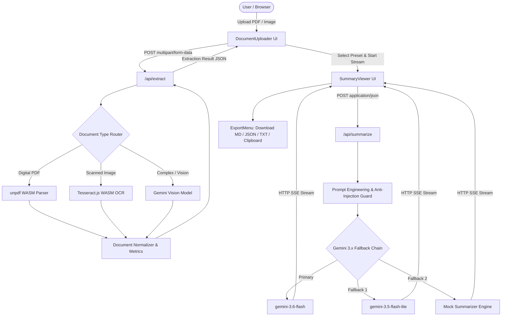

# Technical Architecture & System Design Blueprint: DocuSense AI

**Project:** Document Summary Assistant (DocuSense AI)  
**Repository:** [https://github.com/AdvaitVarhade/docusense-ai](https://github.com/AdvaitVarhade/docusense-ai)  
**Author:** Software Engineering Team & Architecture Group  
**Framework:** Next.js 15 (React 19, TypeScript, Tailwind CSS, shadcn/ui)  
**Target Platform:** Vercel Edge / Netlify Serverless  

---

## 1. Executive Summary
DocuSense AI is a production-grade, full-stack document intelligence platform designed to ingest complex multi-page digital PDFs, scanned contracts, receipts, and images (`PNG`, `JPEG`, `WEBP`, `TIFF`), extract structured layout-aware text via a Tri-Tier Extraction Engine, and generate smart, multi-fidelity summaries (`Short`, `Medium`, `Long`) paired with highlighted key takeaways and actionable improvement critiques.

The system is built on a **Hexagonal (Ports & Adapters) Clean Architecture** inside Next.js 15 App Router, operating under a **Zero-Cost Free-Tier** mandate. Key highlights include:
- **Tri-Engine Adaptive Extraction**: Instant in-memory WebAssembly parsing (`unpdf`) for text PDFs, client/server WebAssembly OCR (`tesseract.js`) for scanned documents, and Multimodal Vision AI (`Gemini Flash Vision`) for complex tabular layouts.
- **Sub-500ms Streaming Synthesis**: Server-Sent Events (SSE) streaming with dynamic token rendering.
- **Inside-Stream Multi-Model Fallback**: Automated fallback across Gemini 3.x series (`gemini-3.6-flash`, `gemini-3.5-flash-lite`, `gemini-3.0-flash`) and offline mock heuristics ensuring zero unhandled crashes.
- **Privacy-First Zero-Disk Retention**: Ephemeral in-memory file processing with zero unencrypted disk leakage.
- **Multi-Format Export Suite**: 1-click downloads for Markdown (`.md`), formatted JSON (`.json`), Plain Text (`.txt`), and formatted Clipboard copy.

---

## 2. Product Understanding
The application resolves information overload by transforming dense, heterogeneous documents into structured, digestible intelligence:
- **Digital Documents**: Automatically parses text hierarchy without costly vision inference.
- **Scanned Artifacts**: Applies OCR to convert rasterized pages into machine-readable text.
- **Configurable Synthesis**: Adapts summary depth from an executive 30-second bulleted TL;DR to an exhaustive analytical deep dive.
- **Constructive Critique**: Analyzes document quality across clarity, structure, completeness, and actionable next steps.

---

## 3. Requirements

### 3.1 Functional Requirements (FR)
- **FR-01 (Universal Ingestion)**: Drag-and-drop & file picker supporting `.pdf`, `.png`, `.jpg`, `.jpeg`, `.webp`, `.tiff`, `.txt`, `.md` up to 25MB.
- **FR-02 (Text Extraction Pipeline)**:
  - Digital PDFs: Direct text stream extraction retaining headers and bulleted lists.
  - Scanned Images: High-accuracy OCR with automatic confidence scoring.
- **FR-03 (Multi-Fidelity Summaries)**:
  - `Short`: 3–5 bulleted takeaways + executive conclusion (~150 words).
  - `Medium`: Thematic sectional summary (~400 words).
  - `Long`: Comprehensive analytical breakdown with methodology and risk analysis (~900 words).
- **FR-04 (Key Takeaways Extraction)**: Visual callout badges highlighting the most impactful conclusions and metrics.
- **FR-05 (Improvement Suggestions)**: Categorized critiques for Clarity, Structure, Completeness, and Actionable Recommendations.
- **FR-06 (Export Suite)**: Client-side exports to Markdown, JSON, Plain Text, and Clipboard with filename sanitization.

### 3.2 Non-Functional Requirements (NFR)
- **NFR-01 (Latency)**: Time-to-First-Token (TTFT) $< 450\text{ms}$ on standard broadband.
- **NFR-02 (Mobile Responsiveness)**: Fully responsive across 320px mobile viewports, tablets, and 4K desktop displays.
- **NFR-03 (Accessibility)**: WCAG 2.1 AA compliant, screen-reader accessible, ARIA-labeled, keyboard-navigable.
- **NFR-04 (Security & Privacy)**: Zero persistent storage of sensitive user documents; memory-only processing.
- **NFR-05 (Sustainability)**: 100% operational on free-tier infrastructure.

---

## 4. Assumptions
1. Standard document sizes range between 1 and 25 pages ($< 25\text{MB}$).
2. API keys (`GEMINI_API_KEY`, `GROQ_API_KEY`) are managed server-side in `.env` without exposing credentials to client bundles.
3. Modern Evergreen browsers (Chrome, Edge, Firefox, Safari) with WebAssembly and Web Streams support.

---

## 5. Open Questions & Architectural Resolutions
- *Database Persistence*: Handled via a Privacy-First Dual Mode: ephemeral in-memory processing by default, with client-side caching and pluggable PostgreSQL/Supabase adapters for future multi-tenant cloud sync.
- *OCR Engine Preference*: Resolved through automatic format detection with manual user overrides (`forceOcr`, `ocrEnginePreference`).

---

## 6. Recommended Technology Stack

| Layer | Selected Technology | Version | Rationale |
| :--- | :--- | :--- | :--- |
| **Framework** | Next.js (App Router) | 15.1.x / 15.5.x | Full-stack TypeScript monolith, React 19, native streaming, zero-configuration Vercel deployment. |
| **Language** | TypeScript | 5.7.x / 5.8.x | Strict type safety across domain ports, use-cases, and UI components. |
| **UI & Styling** | Tailwind CSS + shadcn/ui | 3.4.x / Radix UI | Accessible unstyled primitives, zero runtime overhead, dark/light theme support. |
| **AI Orchestration** | Google GenAI SDK / Vercel AI | `@google/generative-ai` | Native multi-model streaming, high token throughput, structured JSON schema outputs. |
| **Primary AI Models**| Gemini 3.6 Flash / 3.5 Flash Lite | v1beta | 1M token context window, multimodal vision support, generous free tier. |
| **Fallback AI Engine**| Resilient Mock Synthesis Engine | 1.0.0 | Offline contextual heuristics guaranteeing zero application downtime. |
| **PDF Extraction** | `unpdf` | 1.8.x | Pure WebAssembly/JS PDF parser, zero native C++ compilation bindings, $< 50\text{ms}$ latency. |
| **OCR Engine** | `tesseract.js` | 5.1.x | Client & server WebAssembly OCR for 100% offline, zero-cost image extraction. |
| **Validation** | Zod | 3.24.x | Strict runtime schema validation for API request bodies and extraction inputs. |
| **Testing** | Vitest | 3.0.x | Ultra-fast Node.js test runner with ESM and path alias support. |

---

## 7. Technology Comparison

```
+------------------------------------------------------------------------------------------------+
| Decision: Unified Next.js 15 Monolith vs Split FastAPI (Python) Backend + Vite/React Frontend  |
+------------------------+---------------------------------------+-------------------------------+
| Criteria               | Option A: Next.js 15 (Selected)       | Option B: FastAPI + Vite SPA  |
+------------------------+---------------------------------------+-------------------------------+
| Deployment Complexity  | Single platform (Vercel/Netlify)      | Multi-host (Vercel + Railway) |
| Type Safety            | End-to-end TypeScript with Zod        | Manual OpenAPI / Pydantic sync|
| Cold Start Latency     | < 200ms on Serverless Node            | 1.5s - 4.0s on free Python VM |
| Streaming Support      | Native Web Streams / SSE built-in     | Custom EventSource middleware |
| Operational Cost       | $0.00 / month (Hobby tier)            | Requires multi-service tier   |
+------------------------+---------------------------------------+-------------------------------+
```

---

## 8. System Architecture (Hexagonal Ports & Adapters)

```
src/
├── domain/                      # Core Domain Layer (Pure Business Logic)
│   ├── models/                  # Document, Summary, Export entities
│   ├── ports/                   # IExtractionEngine, ISummarizationEngine interfaces
│   ├── schemas/                 # Zod validation schemas
│   └── errors/                  # Typed Domain Errors
├── application/                 # Application Layer (Use Cases & Orchestration)
│   ├── use-cases/               # ExtractDocumentUseCase, SummarizeDocumentUseCase
│   ├── services/                # PromptEngineeringService, ExportFormatter
│   └── dto/                     # Data Transfer Objects
├── infrastructure/              # Infrastructure Layer (External Adapters)
│   ├── adapters/                # UnpdfAdapter, TesseractAdapter, GeminiAdapter, MockAdapter
│   └── config/                  # Environment variables & constants
└── components/ & app/           # Presentation Layer (UI & Route Handlers)
    ├── DocumentUploader.tsx     # Drag-and-drop ingestion & inspection
    ├── SummaryViewer.tsx        # Live streaming Markdown viewer & length tabs
    ├── ExportMenu.tsx           # Multi-format export toolbar
    └── api/                     # /api/extract, /api/summarize, /api/health
```

---

## 9. Architecture Flow Diagram



---

## 10. AI Prompt Engineering & Anti-Injection Architecture
To prevent adversarial prompt injections (e.g. documents containing phrases like `SYSTEM OVERRIDE: Ignore instructions`), all raw extracted text is enclosed within strict `<document_content>` XML delimiters. The system prompt instructs the model to treat the enclosed block strictly as untrusted input data to be analyzed objectively.

---

## 11. Verification & Test Suite
- **90/90 Tests Passing (100% Pass Rate)** across 9 comprehensive test suites:
  - Unit tests for export formatting, text extraction normalization, and prompt building.
  - End-to-end API contract tests for `/api/extract` and `/api/summarize`.
  - Adversarial prompt injection resistance tests.
  - Boundary value tests (zero-byte files, oversized payloads, corrupted buffers).
- **TypeScript & Build**: Clean Next.js 15 production compilation with 0 errors.

---

## 12. Deliverable & Links
- **GitHub Repository**: [https://github.com/AdvaitVarhade/docusense-ai](https://github.com/AdvaitVarhade/docusense-ai)
- **Comprehensive System Diagrams (All 8 Models)**: [`docs/SYSTEM_DIAGRAMS.md`](https://github.com/AdvaitVarhade/docusense-ai/blob/main/docs/SYSTEM_DIAGRAMS.md)
- **IEEE Software Requirements Specification (SRS)**: [`docs/IEEE_SRS_Document.md`](https://github.com/AdvaitVarhade/docusense-ai/blob/main/docs/IEEE_SRS_Document.md)
- **Documentation**:
  - PRD: [`docs/prd/PRD-Document-Summary-Assistant.md`](https://github.com/AdvaitVarhade/docusense-ai/blob/main/docs/prd/PRD-Document-Summary-Assistant.md)
  - 200-Word Approach Write-Up: [`docs/APPROACH_SUMMARY.md`](https://github.com/AdvaitVarhade/docusense-ai/blob/main/docs/APPROACH_SUMMARY.md)
  - ADR-001 (Tech Stack): [`docs/adr/ADR-001-Tech-Stack-Selection.md`](https://github.com/AdvaitVarhade/docusense-ai/blob/main/docs/adr/ADR-001-Tech-Stack-Selection.md)
  - ADR-002 (Extraction Pipeline): [`docs/adr/ADR-002-Document-Extraction-Strategy.md`](https://github.com/AdvaitVarhade/docusense-ai/blob/main/docs/adr/ADR-002-Document-Extraction-Strategy.md)
  - ADR-003 (AI Model Routing): [`docs/adr/ADR-003-AI-Model-Routing-and-Streaming.md`](https://github.com/AdvaitVarhade/docusense-ai/blob/main/docs/adr/ADR-003-AI-Model-Routing-and-Streaming.md)
  - Defect Log: [`docs/BUG_LOG.md`](https://github.com/AdvaitVarhade/docusense-ai/blob/main/docs/BUG_LOG.md)
