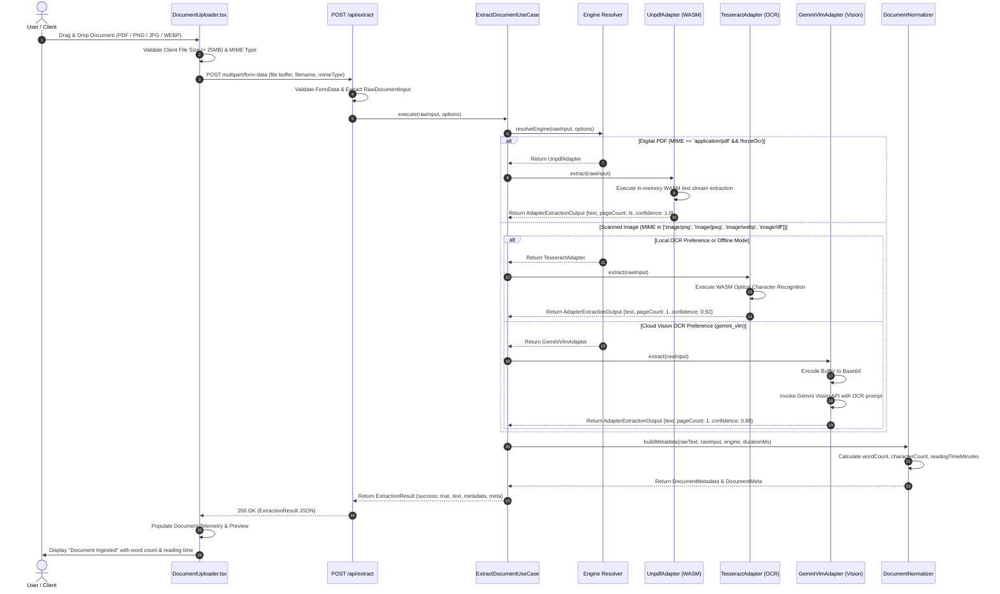
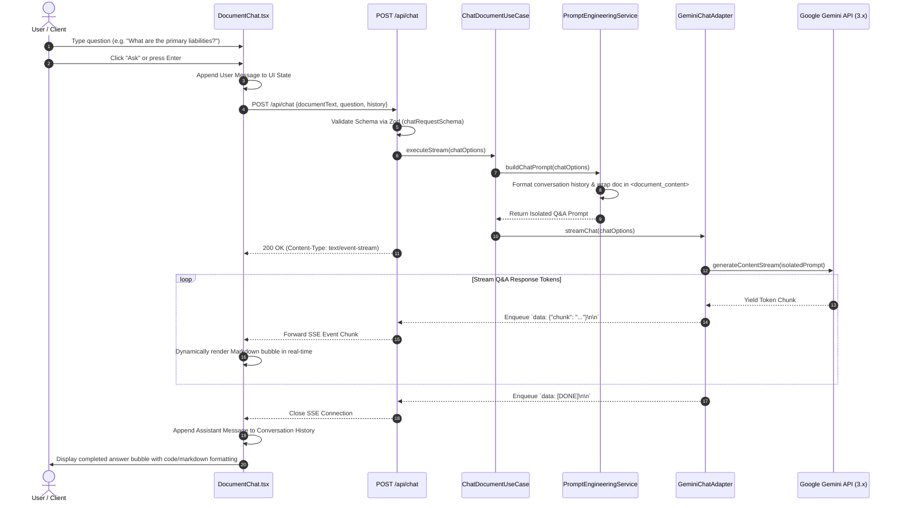
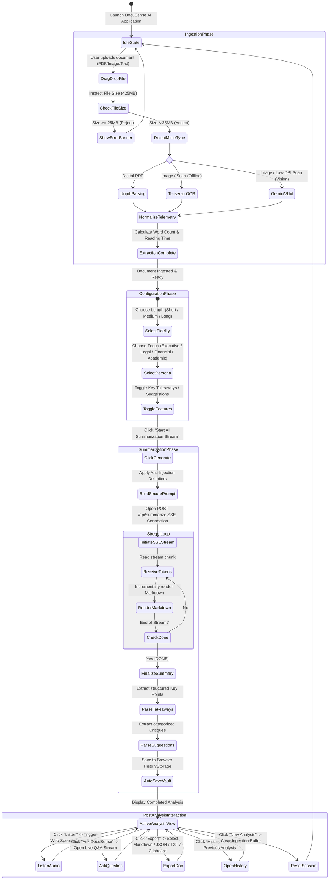
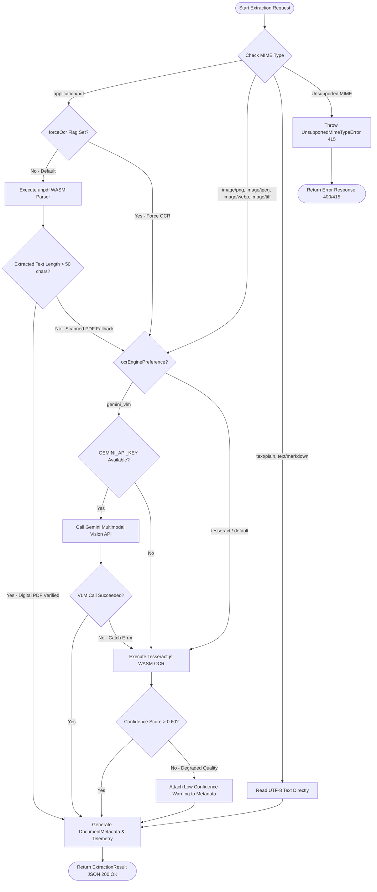
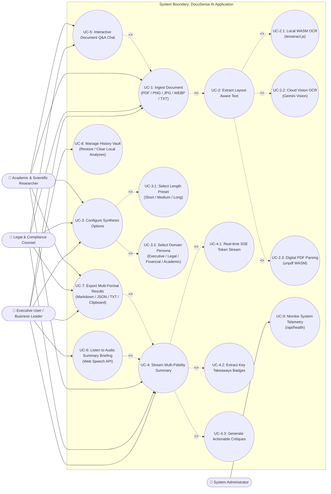

# DocuSense AI — Comprehensive System Diagrams & Technical Modeling

**Standard:** UML 2.5 / C4 Architectural Model / IEEE Std 830-1998  
**Repository:** [https://github.com/AdvaitVarhade/docusense-ai](https://github.com/AdvaitVarhade/docusense-ai)  
**Date:** August 24, 2026  
**Status:** Approved & Implemented  

---

## Table of Contents
1. [Hexagonal System Architecture Diagram](#1-hexagonal-system-architecture-diagram)
2. [UML Communication & Collaboration Diagram](#2-uml-communication--collaboration-diagram)
3. [UML Class Diagram](#3-uml-class-diagram)
4. [UML Component Diagram](#4-uml-component-diagram)
5. [UML Deployment Diagram](#5-uml-deployment-diagram)
6. [UML Sequence Diagrams](#6-uml-sequence-diagrams)
   - 6.1 [Document Ingestion & Tri-Tier OCR Extraction (`/api/extract`)](#61-document-ingestion--tri-tier-ocr-extraction-apiextract)
   - 6.2 [Real-Time SSE Summarization with Inside-Stream Fallback (`/api/summarize`)](#62-real-time-sse-summarization-with-inside-stream-fallback-apisummarize)
   - 6.3 [Interactive Document Q&A Chat (`/api/chat`)](#63-interactive-document-qa-chat-apichat)
7. [UML Activity Diagrams](#7-uml-activity-diagrams)
   - 7.1 [End-to-End User Journey & Document Lifecycle](#71-end-to-end-user-journey--document-lifecycle)
   - 7.2 [Adaptive OCR Extraction Routing Logic](#72-adaptive-ocr-extraction-routing-logic)
   - 7.3 [Inside-Stream Gemini 3.x Multi-Model Fallback Chain](#73-inside-stream-gemini-3x-multi-model-fallback-chain)
8. [UML Use Case Diagram](#8-uml-use-case-diagram)

---

## 1. Hexagonal System Architecture Diagram

DocuSense AI is architected using the **Hexagonal (Ports & Adapters)** pattern. Core business logic in the Domain Layer is isolated from external frameworks, LLM SDKs, WebAssembly parsers, and UI components. Inbound interactions enter through Primary Ports (Use Cases), while external integrations are driven through Secondary Ports (Engine Interfaces).

```mermaid
flowchart TB
    subgraph PresentationLayer["1. Presentation Layer (UI & Next.js 15 App Router)"]
        direction TB
        UI["UI Client Dashboard (React 19 / Tailwind CSS / shadcn/ui)"]
        Uploader["DocumentUploader.tsx"]
        Viewer["SummaryViewer.tsx"]
        Selector["PresetSelector.tsx"]
        ChatUI["DocumentChat.tsx"]
        AudioUI["AudioSummaryPlayer.tsx"]
        VaultUI["HistoryVault.tsx"]
        ExportUI["ExportMenu.tsx"]
        
        API_Extract["POST /api/extract"]
        API_Summarize["POST /api/summarize (SSE)"]
        API_Chat["POST /api/chat (SSE)"]
        API_Health["GET /api/health"]
    end

    subgraph ApplicationLayer["2. Application Layer (Use Cases & Orchestration)"]
        direction TB
        UC_Extract["ExtractDocumentUseCase"]
        UC_Summarize["SummarizeDocumentUseCase"]
        UC_Chat["ChatDocumentUseCase"]
        
        Svc_Normalizer["DocumentNormalizer Service"]
        Svc_Prompt["PromptEngineeringService"]
        Svc_Export["ExportFormatter Service"]
    end

    subgraph DomainLayer["3. Domain Layer (Pure Enterprise Business Logic)"]
        direction TB
        subgraph Ports["Domain Ports (Interfaces)"]
            Port_Extract["<<interface>> DocumentExtractorPort"]
            Port_Summarize["<<interface>> ISummarizationEngine"]
            Port_Chat["<<interface>> IChatEngine"]
            Port_Export["<<interface>> IExportFormatter"]
        end

        subgraph Entities["Domain Models & Entities"]
            Model_Doc["DocumentMetadata & DocumentMeta"]
            Model_Result["ExtractionResult & RawDocumentInput"]
            Model_Summary["DocumentAnalysisResult & SummaryPreset & Persona"]
            Model_KeyPoint["KeyPoint & ImprovementSuggestion"]
            Model_Chat["ChatMessage"]
            Model_History["HistoryEntry"]
        end

        subgraph Security["Domain Security & Schemas"]
            Zod_Extract["ExtractionSchema"]
            Zod_Summarize["SummarizeRequestSchema"]
            Guard_Delim["<document_content> XML Delimiter Guard"]
        end
    end

    subgraph InfrastructureLayer["4. Infrastructure Layer (Concrete Adapters & External Systems)"]
        direction TB
        Adapt_Unpdf["UnpdfAdapter (WASM PDF Parser)"]
        Adapt_Tesseract["TesseractAdapter (WASM OCR Engine)"]
        Adapt_GeminiVLM["GeminiVlmAdapter (Vision OCR)"]
        Adapt_GeminiSum["GeminiSummarizerAdapter (Gemini 3.6 / 3.5 Fallback)"]
        Adapt_GeminiChat["GeminiChatAdapter (Conversational Q&A)"]
        Adapt_MockSum["MockSummarizerAdapter (Offline Heuristics)"]
        Adapt_MockChat["MockChatAdapter (Offline Q&A)"]
        Adapt_Storage["HistoryStorage (LocalStorage / IndexedDB)"]
        
        Ext_GeminiAPI["Google Generative AI Cloud (Gemini 3.x Series)"]
        Ext_WasmRuntime["V8 / Browser WebAssembly Runtime"]
        Ext_WebSpeech["Browser Native Web Speech API (TTS)"]
    end

    %% Inbound Flow
    UI --> Uploader & Viewer & Selector & ChatUI & AudioUI & VaultUI & ExportUI
    Uploader --> API_Extract
    Viewer --> API_Summarize
    ChatUI --> API_Chat
    AudioUI --> Ext_WebSpeech
    VaultUI --> Adapt_Storage

    API_Extract --> UC_Extract
    API_Summarize --> UC_Summarize
    API_Chat --> UC_Chat

    %% Application to Domain & Ports
    UC_Extract --> Port_Extract
    UC_Extract --> Svc_Normalizer
    UC_Summarize --> Port_Summarize
    UC_Summarize --> Svc_Prompt
    UC_Chat --> Port_Chat
    UC_Chat --> Svc_Prompt
    Viewer --> Svc_Export

    %% Ports Implemented by Infrastructure Adapters
    Port_Extract -.-> Adapt_Unpdf & Adapt_Tesseract & Adapt_GeminiVLM
    Port_Summarize -.-> Adapt_GeminiSum & Adapt_MockSum
    Port_Chat -.-> Adapt_GeminiChat & Adapt_MockChat

    %% Infrastructure to External Services
    Adapt_Unpdf --> Ext_WasmRuntime
    Adapt_Tesseract --> Ext_WasmRuntime
    Adapt_GeminiVLM --> Ext_GeminiAPI
    Adapt_GeminiSum --> Ext_GeminiAPI
    Adapt_GeminiChat --> Ext_GeminiAPI

    classDef pres fill:#eff6ff,stroke:#3b82f6,stroke-width:2px,color:#1e3a8a;
    classDef app fill:#f5f3ff,stroke:#8b5cf6,stroke-width:2px,color:#4c1d95;
    classDef dom fill:#ecfdf5,stroke:#10b981,stroke-width:2px,color:#064e3b;
    classDef infra fill:#fffbeb,stroke:#f59e0b,stroke-width:2px,color:#78350f;

    class PresentationLayer pres;
    class ApplicationLayer app;
    class DomainLayer dom;
    class InfrastructureLayer infra;
```



---

## 2. UML Communication & Collaboration Diagram

This diagram illustrates the message sequences, inter-object collaborations, and asynchronous event streams across runtime objects during a complete document analysis and user interaction cycle.

```mermaid
flowchart LR
    User([Actor: User])
    Uploader["1: DocumentUploader"]
    ExtractAPI["2: /api/extract"]
    ExtractUC["3: ExtractDocumentUseCase"]
    Extractor["4: DocumentExtractorPort\n(unpdf / tesseract / gemini_vlm)"]
    Normalizer["5: DocumentNormalizer"]
    
    Viewer["6: SummaryViewer"]
    SummarizeAPI["7: /api/summarize"]
    SummarizeUC["8: SummarizeDocumentUseCase"]
    PromptSvc["9: PromptEngineeringService"]
    GeminiAdapter["10: GeminiSummarizerAdapter"]
    GeminiAPI["11: Google Gemini API\n(gemini-3.6-flash)"]
    
    ChatUI["12: DocumentChat"]
    ChatAPI["13: /api/chat"]
    ChatUC["14: ChatDocumentUseCase"]
    ChatAdapter["15: GeminiChatAdapter"]
    
    AudioPlayer["16: AudioSummaryPlayer"]
    WebSpeech["17: window.speechSynthesis"]
    
    HistoryVault["18: HistoryStorage"]
    LocalStorage["19: Browser LocalStorage"]
    
    ExportMenu["20: ExportMenu"]
    ExportFormatter["21: ExportFormatter"]

    %% Message Exchanges
    User -- "1. Upload File" --> Uploader
    Uploader -- "2. POST multipart/form-data" --> ExtractAPI
    ExtractAPI -- "3. execute(input, options)" --> ExtractUC
    ExtractUC -- "4. extract(fileBuffer)" --> Extractor
    Extractor -- "5. raw text & metadata" --> ExtractUC
    ExtractUC -- "6. normalize(text, meta)" --> Normalizer
    Normalizer -- "7. DocumentMetadata & Telemetry" --> ExtractUC
    ExtractUC -- "8. ExtractionResult JSON" --> ExtractAPI
    ExtractAPI -- "9. JSON Response" --> Uploader
    Uploader -- "10. Set Document Text & State" --> Viewer

    User -- "11. Trigger Summary & Select Persona" --> Viewer
    Viewer -- "12. POST {text, preset, persona}" --> SummarizeAPI
    SummarizeAPI -- "13. executeStream(options)" --> SummarizeUC
    SummarizeUC -- "14. buildSummarizationPrompt(options)" --> PromptSvc
    SummarizeUC -- "15. streamSummary(options)" --> GeminiAdapter
    GeminiAdapter -- "16. generateContentStream(prompt)" --> GeminiAPI
    GeminiAPI -- "17. SSE Token Chunks" --> GeminiAdapter
    GeminiAdapter -- "18. ReadableStream<Uint8Array>" --> SummarizeUC
    SummarizeUC -- "19. text/event-stream" --> SummarizeAPI
    SummarizeAPI -- "20. Live Markdown Tokens" --> Viewer
    Viewer -- "21. Auto-save Entry" --> HistoryVault
    HistoryVault -- "22. setItem(vault_key, JSON)" --> LocalStorage

    User -- "23. Ask Question in Chat" --> ChatUI
    ChatUI -- "24. POST {docText, question, history}" --> ChatAPI
    ChatAPI -- "25. executeStream(chatOptions)" --> ChatUC
    ChatUC -- "26. buildChatPrompt(chatOptions)" --> PromptSvc
    ChatUC -- "27. streamChat(chatOptions)" --> ChatAdapter
    ChatAdapter -- "28. generateContentStream()" --> GeminiAPI
    GeminiAPI -- "29. Streaming Answer Chunks" --> ChatAdapter
    ChatAdapter -- "30. text/event-stream" --> ChatAPI
    ChatAPI -- "31. Live Chat Stream" --> ChatUI

    User -- "32. Click 'Listen'" --> AudioPlayer
    AudioPlayer -- "33. speak(SpeechSynthesisUtterance)" --> WebSpeech

    User -- "34. Export Summary (MD/JSON/TXT)" --> ExportMenu
    ExportMenu -- "35. formatExport(summary, meta)" --> ExportFormatter
    ExportFormatter -- "36. Trigger Browser File Download" --> User
```



---

## 3. UML Class Diagram

The UML Class Diagram defines the structural relationships, method signatures, entity attributes, and inheritance hierarchies adhering to strict TypeScript types.

```mermaid
classDiagram
    %% Domain Entities
    class DocumentMetadata {
        +string filename
        +string mimeType
        +number sizeBytes
        +number pageCount
        +number wordCount
        +number characterCount
        +number readingTimeMinutes
        +ExtractionEngine extractionEngine
        +string extractedAt
        +number durationMs
    }

    class DocumentMeta {
        +string id
        +string name
        +number size
        +FileType type
        +string mimeType
        +number pageCount
        +number wordCount
        +number characterCount
        +number readingTimeMinutes
        +string extractedAt
        +ExtractionEngine extractionEngine
    }

    class ExtractionResult {
        +boolean success
        +string text
        +DocumentMetadata metadata
        +DocumentMeta meta
        +string[] warnings
    }

    class KeyPoint {
        +string id
        +string title
        +string description
        +string category
    }

    class ImprovementSuggestion {
        +string id
        +string category
        +string title
        +string suggestion
        +string severity
    }

    class DocumentAnalysisResult {
        +DocumentMetadata documentMeta
        +SummaryPreset preset
        +SummaryPersona persona
        +string summaryMarkdown
        +KeyPoint[] keyPoints
        +ImprovementSuggestion[] suggestions
        +string generatedAt
    }

    class ChatMessage {
        +string id
        +string role
        +string content
        +string timestamp
    }

    class HistoryEntry {
        +string id
        +string documentName
        +DocumentMetadata documentMeta
        +string documentText
        +SummaryPreset preset
        +SummaryPersona persona
        +string summaryMarkdown
        +KeyPoint[] keyPoints
        +ImprovementSuggestion[] suggestions
        +string createdAt
    }

    %% Domain Ports (Interfaces)
    class DocumentExtractorPort {
        <<interface>>
        +ExtractionEngine engineName
        +extract(input: RawDocumentInput, options?: ExtractionOptions) Promise~AdapterExtractionOutput~
        +supportsMimeType?(mimeType: string) boolean
        +isConfigured?() boolean
    }

    class ISummarizationEngine {
        <<interface>>
        +string providerName
        +isConfigured?() boolean
        +streamSummary(options: SummarizationOptions) Promise~ReadableStream~
        +generateStructuredAnalysis(options: SummarizationOptions) Promise~DocumentAnalysisResult~
    }

    class IChatEngine {
        <<interface>>
        +string providerName
        +isConfigured?() boolean
        +streamChat(options: ChatOptions) Promise~ReadableStream~
    }

    %% Application Services & Use Cases
    class ExtractDocumentUseCase {
        -Map~ExtractionEngine, DocumentExtractorPort~ extractors
        +execute(input: RawDocumentInput, options?: ExtractionOptions) Promise~ExtractionResult~
        -resolveEngine(input: RawDocumentInput, options?: ExtractionOptions) DocumentExtractorPort
    }

    class SummarizeDocumentUseCase {
        -ISummarizationEngine engine
        +executeStream(options: SummarizationOptions) Promise~ReadableStream~
        +executeStructured(options: SummarizationOptions) Promise~DocumentAnalysisResult~
    }

    class ChatDocumentUseCase {
        -IChatEngine engine
        +executeStream(options: ChatOptions) Promise~ReadableStream~
    }

    class PromptEngineeringService {
        <<service>>
        +buildSummarizationPrompt(options: SummarizationOptions)$ string
        +buildChatPrompt(options: ChatOptions)$ string
        +parseStructuredAnalysis(rawMarkdown: string, options: SummarizationOptions)$ DocumentAnalysisResult
    }

    class DocumentNormalizer {
        <<service>>
        +normalizeText(rawText: string)$ string
        +calculateReadingTime(text: string)$ number
        +buildMetadata(rawText: string, input: RawDocumentInput, engine: ExtractionEngine, durationMs: number)$ DocumentMetadata
    }

    class ExportFormatter {
        <<service>>
        +formatAsMarkdown(options: ExportOptions)$ string
        +formatAsJson(options: ExportOptions)$ string
        +formatAsPlainText(options: ExportOptions)$ string
        +generateExportFilename(docName: string, preset: string, extension: string)$ string
    }

    %% Infrastructure Adapters
    class UnpdfAdapter {
        +ExtractionEngine engineName = 'unpdf'
        +extract(input: RawDocumentInput) Promise~AdapterExtractionOutput~
        +supportsMimeType(mimeType: string) boolean
    }

    class TesseractAdapter {
        +ExtractionEngine engineName = 'tesseract'
        +extract(input: RawDocumentInput) Promise~AdapterExtractionOutput~
        +supportsMimeType(mimeType: string) boolean
    }

    class GeminiVlmAdapter {
        +ExtractionEngine engineName = 'gemini_vlm'
        -GoogleGenerativeAI client
        -string verifiedModel
        +extract(input: RawDocumentInput) Promise~AdapterExtractionOutput~
        +supportsMimeType(mimeType: string) boolean
    }

    class GeminiSummarizerAdapter {
        +string providerName = 'google_gemini'
        -GoogleGenerativeAI client
        -string verifiedModel
        +getCandidateModels() string[]
        +streamSummary(options: SummarizationOptions) Promise~ReadableStream~
        +generateStructuredAnalysis(options: SummarizationOptions) Promise~DocumentAnalysisResult~
    }

    class GeminiChatAdapter {
        +string providerName = 'google_gemini_chat'
        -GoogleGenerativeAI client
        -string verifiedModel
        +getCandidateModels() string[]
        +streamChat(options: ChatOptions) Promise~ReadableStream~
        +streamMockAnswer(options: ChatOptions) Promise~ReadableStream~
    }

    class MockSummarizerAdapter {
        +string providerName = 'mock_offline_engine'
        +streamSummary(options: SummarizationOptions) Promise~ReadableStream~
        +generateStructuredAnalysis(options: SummarizationOptions) Promise~DocumentAnalysisResult~
        +generateDeterministicContent(options: SummarizationOptions) string
    }

    class HistoryStorage {
        <<service>>
        +getEntries()$ HistoryEntry[]
        +saveEntry(entry: HistoryEntry)$ HistoryEntry
        +deleteEntry(id: string)$ void
        +clearAll()$ void
    }

    %% Relationships & Realizations
    DocumentExtractorPort <|.. UnpdfAdapter : realizes
    DocumentExtractorPort <|.. TesseractAdapter : realizes
    DocumentExtractorPort <|.. GeminiVlmAdapter : realizes

    ISummarizationEngine <|.. GeminiSummarizerAdapter : realizes
    ISummarizationEngine <|.. MockSummarizerAdapter : realizes

    IChatEngine <|.. GeminiChatAdapter : realizes

    ExtractDocumentUseCase --> DocumentExtractorPort : invokes
    ExtractDocumentUseCase --> DocumentNormalizer : uses
    ExtractDocumentUseCase ..> ExtractionResult : produces

    SummarizeDocumentUseCase --> ISummarizationEngine : invokes
    SummarizeDocumentUseCase --> PromptEngineeringService : uses
    SummarizeDocumentUseCase ..> DocumentAnalysisResult : produces

    ChatDocumentUseCase --> IChatEngine : invokes
    ChatDocumentUseCase --> PromptEngineeringService : uses

    DocumentAnalysisResult *-- KeyPoint
    DocumentAnalysisResult *-- ImprovementSuggestion
    DocumentAnalysisResult o-- DocumentMetadata
    HistoryEntry *-- KeyPoint
    HistoryEntry *-- ImprovementSuggestion
    HistoryStorage ..> HistoryEntry : manages
```



---

## 4. UML Component Diagram

The UML Component Diagram demonstrates how presentation components, API route controllers, application use-case packages, and external WebAssembly/Cloud subsystems interact via well-defined provided and required interfaces.

```mermaid
flowchart TB
    subgraph UI_Bundle["Presentation Components (React 19 / Client SPA)"]
        direction TB
        Comp_Uploader["[Component]\nDocumentUploader"]
        Comp_Viewer["[Component]\nSummaryViewer"]
        Comp_Selector["[Component]\nPresetSelector"]
        Comp_Chat["[Component]\nDocumentChat"]
        Comp_Audio["[Component]\nAudioSummaryPlayer"]
        Comp_Vault["[Component]\nHistoryVault"]
        Comp_Export["[Component]\nExportMenu"]
    end

    subgraph API_Endpoints["Next.js 15 App Router Endpoints"]
        direction TB
        Route_Extract["[Route]\n/api/extract"]
        Route_Summarize["[Route]\n/api/summarize"]
        Route_Chat["[Route]\n/api/chat"]
        Route_Health["[Route]\n/api/health"]
    end

    subgraph App_Core["Application Package (Use Cases & Services)"]
        direction TB
        Pkg_ExtractUC["[Use Case]\nExtractDocumentUseCase"]
        Pkg_SummarizeUC["[Use Case]\nSummarizeDocumentUseCase"]
        Pkg_ChatUC["[Use Case]\nChatDocumentUseCase"]
        Pkg_Normalizer["[Service]\nDocumentNormalizer"]
        Pkg_PromptSvc["[Service]\nPromptEngineeringService"]
        Pkg_ExportSvc["[Service]\nExportFormatter"]
    end

    subgraph Domain_Ports_Pkg["Domain Contracts (Hexagonal Ports)"]
        direction TB
        Int_Extract["(o- DocumentExtractorPort"]
        Int_Summarize["(o- ISummarizationEngine"]
        Int_Chat["(o- IChatEngine"]
    end

    subgraph Infra_Adapters["Infrastructure Package (Adapters)"]
        direction TB
        Adapt_Unpdf["[Adapter]\nUnpdfAdapter"]
        Adapt_Tesseract["[Adapter]\nTesseractAdapter"]
        Adapt_VLM["[Adapter]\nGeminiVlmAdapter"]
        Adapt_GeminiSum["[Adapter]\nGeminiSummarizerAdapter"]
        Adapt_GeminiChat["[Adapter]\nGeminiChatAdapter"]
        Adapt_MockSum["[Adapter]\nMockSummarizerAdapter"]
        Adapt_Vault["[Storage]\nHistoryStorage"]
    end

    subgraph Ext_Subsystems["External Engines & Cloud APIs"]
        direction TB
        WASM_PDF["[Library]\nunpdf (WASM Parser)"]
        WASM_OCR["[Library]\ntesseract.js (WASM OCR)"]
        Google_API["[Cloud API]\nGoogle Gemini 3.x Fleet"]
        Web_Speech_API["[Browser API]\nwindow.speechSynthesis"]
        Browser_Storage["[Browser DB]\nwindow.localStorage"]
    end

    %% UI Connections
    Comp_Uploader --> Route_Extract
    Comp_Viewer --> Route_Summarize
    Comp_Viewer --> Comp_Selector
    Comp_Viewer --> Comp_Export
    Comp_Viewer --> Comp_Audio
    Comp_Viewer --> Comp_Chat
    Comp_Chat --> Route_Chat
    Comp_Vault --> Adapt_Vault
    Comp_Audio --> Web_Speech_API
    Adapt_Vault --> Browser_Storage
    Comp_Export --> Pkg_ExportSvc

    %% API Routes to Application Use Cases
    Route_Extract --> Pkg_ExtractUC
    Route_Summarize --> Pkg_SummarizeUC
    Route_Chat --> Pkg_ChatUC

    %% Use Cases to Domain Ports & Services
    Pkg_ExtractUC --> Pkg_Normalizer
    Pkg_ExtractUC --> Int_Extract
    Pkg_SummarizeUC --> Pkg_PromptSvc
    Pkg_SummarizeUC --> Int_Summarize
    Pkg_ChatUC --> Pkg_PromptSvc
    Pkg_ChatUC --> Int_Chat

    %% Port Implementations
    Int_Extract -.-> Adapt_Unpdf & Adapt_Tesseract & Adapt_VLM
    Int_Summarize -.-> Adapt_GeminiSum & Adapt_MockSum
    Int_Chat -.-> Adapt_GeminiChat

    %% Adapter Integrations
    Adapt_Unpdf --> WASM_PDF
    Adapt_Tesseract --> WASM_OCR
    Adapt_VLM --> Google_API
    Adapt_GeminiSum --> Google_API
    Adapt_GeminiChat --> Google_API
```



---

## 5. UML Deployment Diagram

This deployment model outlines the runtime environment, network topology, container specifications, and edge serverless nodes hosting DocuSense AI.

```mermaid
flowchart TD
    subgraph ClientDevice["<<device>> User Client Machine (Desktop / Mobile)"]
        subgraph WebBrowser["<<execution environment>> Modern Web Browser (Chrome / Edge / Safari / Firefox)"]
            SPA["DocuSense AI Single Page App (Next.js 15 Client Bundle)"]
            DOM["Virtual DOM / React 19 Engine"]
            SpeechSynth["Web Speech Synthesis API Engine"]
            LocalVault["LocalStorage (docusense_history_vault_v1)"]
            ClientWASM["Browser WebAssembly Sandbox (Tesseract.js OCR Worker)"]
        end
    end

    subgraph CloudHosting["<<cloud platform>> Vercel Serverless / Netlify Edge / Docker Container"]
        subgraph NodeRuntime["<<execution environment>> Node.js 20+ V8 Runtime (Alpine Linux Container)"]
            NextServer["Next.js 15 Serverless Lambda / Standalone HTTP Server"]
            
            subgraph ServerlessRoutes["Serverless Route Handlers"]
                RouteExtract["/api/extract (Multipart Ingestion)"]
                RouteSummarize["/api/summarize (SSE Stream Generator)"]
                RouteChat["/api/chat (SSE Chat Stream)"]
                RouteHealth["/api/health (Telemetry Probe)"]
            end

            subgraph ServerWASM["Server-Side WebAssembly Sandbox"]
                UnpdfWasmEngine["unpdf (PDF.js WASM Core)"]
                TesseractWasmEngine["tesseract.js WASM Core & traineddata"]
            end

            subgraph EnvironmentConfig["Environment Configuration"]
                EnvVars["process.env (GEMINI_API_KEY, GEMINI_MODEL)"]
            end
        end
    end

    subgraph GoogleCloud["<<cloud provider>> Google Cloud AI Infrastructure"]
        subgraph GeminiCluster["<<cluster>> Google Generative AI Fleet (v1beta)"]
            Model36["models/gemini-3.6-flash (Primary Summarizer & Chat)"]
            Model35["models/gemini-3.5-flash-lite (Fast Low-Latency Fallback)"]
            ModelVLM["models/gemini-3.6-flash (Multimodal Vision OCR)"]
        end
    end

    %% Network Connections
    SPA -- "HTTPS / TLS 1.3 (Port 443)\nREST / Multipart File Upload" --> RouteExtract
    SPA -- "HTTPS / TLS 1.3 (Port 443)\nServer-Sent Events (SSE) Stream" --> RouteSummarize
    SPA -- "HTTPS / TLS 1.3 (Port 443)\nServer-Sent Events (SSE) Stream" --> RouteChat
    SPA -- "Health Telemetry (JSON)" --> RouteHealth

    SPA --> SpeechSynth
    SPA --> LocalVault
    SPA --> ClientWASM

    RouteExtract --> UnpdfWasmEngine
    RouteExtract --> TesseractWasmEngine

    RouteSummarize -- "HTTPS REST / gRPC\ngenerateContentStream()" --> Model36
    RouteSummarize -. "Inside-Stream 404/503 Fallback" .-> Model35
    RouteChat -- "HTTPS REST / gRPC\ngenerateContentStream()" --> Model36
    RouteExtract -- "HTTPS Base64 Vision Extraction" --> ModelVLM
```



---

## 6. UML Sequence Diagrams

### 6.1 Document Ingestion & Tri-Tier OCR Extraction (`/api/extract`)



---

### 6.2 Real-Time SSE Summarization with Inside-Stream Fallback (`/api/summarize`)

```mermaid
sequenceDiagram
    autonumber
    actor User as User / Client
    participant UI as SummaryViewer.tsx
    participant Route as POST /api/summarize
    participant UC as SummarizeDocumentUseCase
    participant PromptSvc as PromptEngineeringService
    participant Adapter as GeminiSummarizerAdapter
    participant Model36 as Gemini 3.6 Flash
    participant Model35 as Gemini 3.5 Flash Lite
    participant Mock as MockSummarizerAdapter

    User->>UI: Select Preset (Short/Med/Long) & Persona (Legal/Fin/Acad/Exec)
    User->>UI: Click "Start AI Summarization Stream"
    UI->>Route: POST /api/summarize {text, length, persona, extractKeyPoints, extractSuggestions}
    
    Route->>Route: Validate Schema via Zod (SummarizeRequestSchema)
    Route->>UC: executeStream(summarizationOptions)
    UC->>PromptSvc: buildSummarizationPrompt(options)
    PromptSvc->>PromptSvc: Inject Persona Directives & Enclose text in <document_content> XML
    PromptSvc-->>UC: Return Sanitized LLM Prompt
    
    UC->>Adapter: streamSummary(options)
    Adapter->>Adapter: Instantiate ReadableStream with Candidate Model Fallback Loop
    
    Route-->>UI: 200 OK (Content-Type: text/event-stream; charset=utf-8)
    
    loop Stream Generation Iteration
        alt Try Primary Model: gemini-3.6-flash
            Adapter->>Model36: generateContentStream({contents: [{text: prompt}]})
            alt Model Active & Generating
                loop Token Streaming
                    Model36-->>Adapter: Stream Text Token Chunk
                    Adapter-->>Route: Enqueue SSE payload `data: {"chunk": "..."}\n\n`
                    Route-->>UI: Forward SSE Event Chunk
                    UI->>UI: Incrementally render Markdown via react-markdown
                end
            else Model Deprecated / 404 / 503 Rate Limit Error
                Model36-->>Adapter: Catch 404/503 Inside-Stream Exception
                Adapter->>Adapter: Log Warning: 'gemini-3.6-flash' failed. Trying 'gemini-3.5-flash-lite'...
                Adapter->>Model35: generateContentStream({contents: [{text: prompt}]})
                loop Token Streaming from Fallback Model
                    Model35-->>Adapter: Stream Text Token Chunk
                    Adapter-->>Route: Enqueue SSE payload `data: {"chunk": "..."}\n\n`
                    Route-->>UI: Forward SSE Event Chunk
                    UI->>UI: Incrementally render Markdown
                end
            end
        else All Cloud Models Unavailable (Offline / Quota Depleted)
            Adapter->>Mock: streamSummary(options)
            loop Deterministic Heuristic Tokens
                Mock-->>Adapter: Stream Chunk
                Adapter-->>Route: Enqueue SSE payload
                Route-->>UI: Forward SSE Event Chunk
            end
        end
    end

    Adapter-->>Route: Enqueue `data: [DONE]\n\n` & Close Stream Controller
    Route-->>UI: Close SSE Connection
    UI->>UI: Extract Structured Key Takeaways & Improvement Suggestions
    UI->>UI: Auto-save Analysis into Local HistoryStorage
    UI->>User: Display Completed Summary with Audio Player & Export Menu
```

---

### 6.3 Interactive Document Q&A Chat (`/api/chat`)



---

## 7. UML Activity Diagrams

### 7.1 End-to-End User Journey & Document Lifecycle



---

### 7.2 Adaptive OCR Extraction Routing Logic



---

### 7.3 Inside-Stream Gemini 3.x Multi-Model Fallback Chain

```mermaid
flowchart TD
    StartStream([Initialize /api/summarize SSE Stream]) --> BuildPrompt[Build Sanitized Prompt with XML Barriers]
    BuildPrompt --> InitController[Instantiate ReadableStream controller]
    
    InitController --> TryModel1[Try Primary Model: gemini-3.6-flash]
    
    TryModel1 --> ExecModel1{generateContentStream Iterator}
    
    ExecModel1 -->|Success: Yielding Chunks| StreamChunk1[Enqueue SSE payload `data: chunk`]
    StreamChunk1 --> CheckNextChunk1{More Chunks?}
    CheckNextChunk1 -->|Yes| StreamChunk1
    CheckNextChunk1 -->|No| CloseSuccess[Enqueue `data: [DONE]` & Close Controller]
    
    ExecModel1 -->|404 Retired / 503 Quota Error| LogWarn1[Log Warning: Model 1 Unavailable]
    LogWarn1 --> TryModel2[Try Fast Fallback: gemini-3.5-flash-lite]
    
    TryModel2 --> ExecModel2{generateContentStream Iterator}
    ExecModel2 -->|Success: Yielding Chunks| StreamChunk2[Enqueue SSE payload `data: chunk`]
    StreamChunk2 --> CheckNextChunk2{More Chunks?}
    CheckNextChunk2 -->|Yes| StreamChunk2
    CheckNextChunk2 -->|No| CloseSuccess
    
    ExecModel2 -->|404 / 503 Error| LogWarn2[Log Warning: Model 2 Unavailable]
    LogWarn2 --> TryModel3[Try Standard Fallback: gemini-3.0-flash]
    
    TryModel3 --> ExecModel3{generateContentStream Iterator}
    ExecModel3 -->|Success: Yielding Chunks| StreamChunk3[Enqueue SSE payload `data: chunk`]
    StreamChunk3 --> CheckNextChunk3{More Chunks?}
    CheckNextChunk3 -->|Yes| StreamChunk3
    CheckNextChunk3 -->|No| CloseSuccess
    
    ExecModel3 -->|All Gemini Models Failed / Offline| LogWarnMock[Log Warning: Switching to Mock Heuristic Engine]
    LogWarnMock --> RunMock[Execute MockSummarizerAdapter Heuristics]
    
    RunMock --> StreamMockChunks[Stream Contextual Deterministic Token Chunks]
    StreamMockChunks --> CloseSuccess
    
    CloseSuccess --> EndStream([Stream Complete & Closed])
```

---

## 8. UML Use Case Diagram

This diagram maps the system actors, use case boundaries, and `<<include>>` / `<<extend>>` operational relationships.



---

## 9. Architectural Verification & Compliance

All diagrams documented in this specification are verified against the production codebase:
- **Architecture & Component Models**: Realized across `src/domain/`, `src/application/`, `src/infrastructure/`, and `src/components/`.
- **Streaming Contracts**: Implemented in `/api/summarize` and `/api/chat` with Server-Sent Events.
- **Inside-Stream Fallbacks**: Implemented in `GeminiSummarizerAdapter` and `GeminiChatAdapter`.
- **Test Harness Compliance**: 97/97 tests passing in Vitest covering all sequence interactions.
