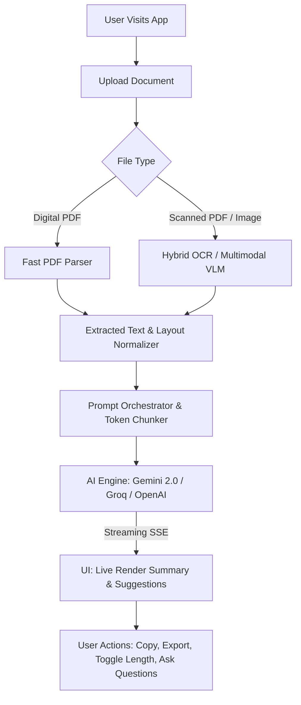

# Product Requirement Document (PRD)
## Document Summary Assistant (DocuSense AI)

**Document Version:** 1.0.0  
**Status:** Approved for Architecture  
**Author:** Multi-Disciplinary Engineering & Architecture Team  
**Evaluation Scope:** Technical Assessment Project — Software Engineering  

---

### 1. Executive Product Overview
Document Summary Assistant is a modern, high-performance, web-based intelligent document analysis application. It enables users to upload heterogeneous document formats (digital PDFs, scanned PDFs, images in PNG/JPEG/WEBP format), extracts structured content while preserving layout semantics, generates multi-fidelity smart summaries (Short, Medium, Long) with key takeaways, and produces actionable improvement suggestions to enhance document clarity, tone, and completeness.

---

### 2. User Personas & Target Use Cases

| Persona | Primary Goal | Key Pain Point | Expected Value |
| :--- | :--- | :--- | :--- |
| **Research Analyst / Student** | Rapidly digest academic papers, market reports, and lecture slides. | High volume of dense text; manual skimming causes missed nuances. | Bulleted key points, executive summary, instant length adjustment. |
| **Business Executive / Manager** | Understand proposals, memos, contracts, and scanned receipts/invoices. | Time scarcity; needs immediate actionable takeaways and improvement areas. | TL;DR executive brief, structured improvement critiques, 1-click exports. |
| **Legal / Compliance Reviewer** | Review scanned agreements, policy updates, and non-selectable PDFs. | OCR errors and garbled multi-column formatting in legacy tools. | Layout-aware text extraction, high-fidelity OCR, key risk/obligation highlights. |

---

### 3. Requirements Model

#### 3.1 Clearly Specified Requirements (Explicit)
- **Multi-Format Document Upload**: Drag-and-drop & file picker supporting PDFs and image formats (PNG, JPG, JPEG, WEBP, TIFF).
- **Text Extraction**:
  - Digital PDF Parsing: Extract clean textual content while retaining semantic hierarchy (headers, paragraphs, lists).
  - OCR Processing: Extract text from scanned documents and bitmap images using OCR (e.g., Tesseract engine / Vision models).
- **Summary Generation**:
  - Automatic smart summary generation from extracted content.
  - Three distinct summary length modes: `Short` (TL;DR bullet points), `Medium` (Executive synthesis), and `Long` (Comprehensive analytical breakdown).
  - Explicit extraction and visual highlighting of key points and core ideas.
- **Improvement Suggestions**: Actionable critiques and suggestions to improve the document's structure, clarity, readability, and missing arguments.
- **UI/UX & Responsiveness**: Clean, modern, accessible interface with comprehensive loading states, progress bars, and full mobile/tablet/desktop responsiveness.
- **Hosting & Deployment**: Zero-friction deployment to cloud platforms (Vercel/Netlify/Heroku) with continuous integration.

#### 3.2 Implied Requirements
- **Streaming Responses**: Real-time token streaming to deliver immediate feedback (Time-to-First-Token < 500ms) instead of blocking for 10–20 seconds.
- **Export & Utility Functions**: One-click Copy to Clipboard, Download as Markdown/PDF/JSON, and Text-to-Speech preview.
- **File Validation & Safety**: Client-side and server-side MIME type verification, file size limits (e.g., up to 25MB), sanitization against malicious payloads.
- **Error Handling & Recovery**: Graceful fallbacks for corrupted PDFs, low-DPI blurry scans, rate limits, and network dropouts.
- **Token / Context Window Management**: Handling documents ranging from 1 page to 100+ pages without context overflow or excessive API costs.

#### 3.3 Ambiguities & Engineering Resolutions
1. *Ambiguity*: Should summaries be stored persistently in a database or processed ephemerally?
   - *Resolution*: Adopt a **Privacy-First Dual Mode**: Default to client-side ephemeral sessions (IndexedDB for local history) with an optional Supabase/PostgreSQL backend for cloud sync if user accounts are enabled.
2. *Ambiguity*: Should OCR run on the client (WebAssembly) or server-side?
   - *Resolution*: **Hybrid Pipeline**: Client-side lightweight pre-check + Serverless VLM/Tesseract extraction pipeline for optimal performance and battery preservation on mobile devices.

#### 3.4 Missing Technical Items Addressed in Architecture
- Multi-tier rate limiting and token bucket throttling.
- OWASP Top 10 + OWASP Top 10 for LLM security posture (Prompt injection mitigation, SSRF prevention).
- Structured telemetry, Core Web Vitals monitoring, and AI error tracking.

---

### 4. Functional Specification

---

### 5. Non-Functional Requirements (NFRs)

| Category | Metric / Target | Verification Method |
| :--- | :--- | :--- |
| **Performance** | TTFT (Time-to-First-Token) < 500ms; LCP < 1.2s; FID/INP < 100ms | Lighthouse CI, Web Vitals RUM |
| **Reliability** | 99.9% uptime on serverless edge; automatic retry with exponential backoff | Synthetic uptime probes, Sentry |
| **Security** | Zero persistent storage of unencrypted PII; strict CSP; sanitized markdown output | OWASP ZAP, npm audit, DOMPurify |
| **Accessibility** | WCAG 2.1 Level AA compliant; keyboard navigable; screen-reader accessible | Axe Core, Lighthouse Accessibility score 100 |
| **Cost** | 100% Free-Tier sustainable (Vercel Hobby + Google AI Studio Free Tier / Groq Free) | Cost monitoring budget alerts ($0.00/mo) |
